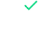

<h1  align="center">



</h1>

  

##  Checklist de Requisitos

  

Pré-requisito - Nível 1

  

- [x] Utilizar Vue.js versão 3+

- [x] Montar as telas do app seguindo fielmente o design

- [x] Não utilizar nenhum framework CSS

- [x] Utilizar Stylus como pré-processador CSS

- [x] Componentizar os elementos das telas o máximo possível.

  

Pré-requisito - Nível 2

- [x] Programar a aplicação TodoList

- [x] Utilizar localstorage para persistir os dados

- [x] Utilizar ECMAScript 6+

- [x] Colocar projeto no Github

  

Plus - Nível 1

 
- [x] Responsividade das telas

- [x] Comente o código criando uma mini documentação

- [x] Hospede o projeto em um servidor e nos mande a URL para visualização.

  

Plus - Nível 2

- [x] Crie o recurso de edição da tarefa

- [x] Implemente uma busca que utiliza os campos título e descrição juntos.

 - [x] Ao listar todas as tarefas, ordene a lista de acordo com a prioridade: Urgentes, Importantes, Outras

 - [x] Utilize o Vuex

  
  

###  Instalação de dependencias e  execuçào do ambiente development


  

```bash

#### Clone o repositorio ou faça download do .zip

$  git  clone  https://github.com/brvnfr/vue-todo-app.git

  

#### Acesse o diretorio

$  cd  vue-todo-app

  

#### Instale as dependências

$  npm  i

  

#### Execute a aplicação em modo development

$  npm  run  serve